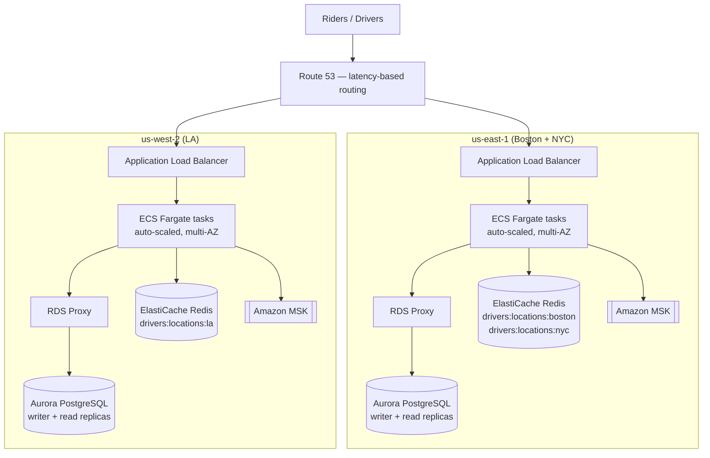

# Uber Clone — Kotlin Backend

A ride-hailing backend built with Kotlin and Spring Boot. Covers the core Uber flow: riders request trips, drivers come online and accept them, fares are calculated from GPS distance with surge pricing, and both sides can rate each other after completion.

## Stack

| Layer | Technology |
|---|---|
| Language | Kotlin 2.2 / JVM 21 |
| Framework | Spring Boot 3.4 |
| Database | PostgreSQL (Spring Data JPA) |
| Cache | Redis (Spring Data Redis) |
| Messaging | Kafka (Spring Kafka) |
| Auth | JWT (JJWT 0.12) via HttpOnly cookies |
| Migrations | Flyway |
| Build | Gradle (Kotlin DSL) |

## Features

**Dispatch** — when a rider requests a trip, the ride is saved and a Kafka event is published immediately so `POST /rides` returns fast. A Kafka consumer picks up the event asynchronously, finds all online drivers within 5 km using a Redis geo-index, and publishes a ride offer to each driver's Redis pub/sub channel (`ride_offers:{driverId}`), including the driver's ETA to the rider. Drivers receive offers in real time over a persistent SSE connection (`GET /driver/offers`). The first driver to call `POST /rides/{id}/accept` gets the ride; concurrent accepts are handled safely with JPA optimistic locking. A scheduled job re-publishes any ride still stuck in `REQUESTED` after 2 minutes, so a dropped Kafka message or dispatch to zero available drivers doesn't strand a rider.

**Rides** — rides move through a status machine: `REQUESTED → MATCHED → IN_PROGRESS → COMPLETED` (or `CANCELLED`). Fare is calculated once at request time using the Haversine distance formula plus the current surge multiplier, and locked in — the rider pays that price regardless of surge changes during the trip. Riders get a live ETA to pickup once a driver accepts, then a live ETA to the destination once the trip starts, both recalculated as the driver's GPS location updates.

**Surge pricing** — Redis-backed surge multiplier keyed by geographic area. Multiplier scales with local demand and is cached with a TTL.

**Driver management** — drivers register with vehicle details, toggle online/offline status, update their GPS location, and can query for nearby online drivers within a configurable radius. Online drivers are tracked in a Redis geo-index for proximity queries and a Redis Set (`drivers:available`) for O(1) availability checks — no Postgres table scans on dispatch.

**Ratings** — after a ride completes, riders and drivers can rate each other. Average ratings are stored on the driver profile.

**Auth & roles** — register, login, and `/auth/me`. JWTs are issued as HttpOnly cookies and carry a `role` claim (`RIDER` or `DRIVER`). All users start as `RIDER`. Calling `POST /driver/register` permanently upgrades the DB role to `DRIVER` and reissues the cookie. Drivers can toggle between modes with `POST /auth/switch-mode` — this only changes the active JWT claim, not the DB role. `@PreAuthorize` guards ensure riders can't call driver endpoints and vice versa. Passwords are BCrypt-hashed.

**Kafka events** — `ride-requested` triggers async dispatch; `ride-accepted`, `ride-completed`, and `ride-cancelled` are consumed for downstream work (payment processing, analytics) and to close the rider's live location stream.

**Rate limiting** — Redis-backed token buckets (Bucket4j) cap ride requests to 5/minute per rider and login/register attempts to 10/15 minutes per IP, so a retry loop or brute-force attempt can't hammer the API or the DB.

## Deployment architecture (AWS)

Ride matching is inherently local — a driver in LA never matches a rider in Boston — so the deployment is split by region rather than run as one global stack. Each region is fully self-contained (its own compute, Postgres, Redis, and Kafka), which gives both lower latency for the region it serves and fault isolation: an outage in one region doesn't affect the other.

**Capacity assumptions (back-of-envelope, for sizing purposes):**
- Scope: three cities — **Boston, New York, and LA** — grouped by coast: NYC + Boston in `us-east-1`, LA in `us-west-2`, since LA is ~2,500 miles / 60-80ms round-trip from the East Coast and ride matching has no cross-city dependency.
- Peak concurrent online drivers (rough, by relative city size): NYC ~100k, LA ~50k, Boston ~20k → **~170k concurrent driver SSE connections** at peak across all three.
- Rider SSE connections are far fewer at any instant despite similar request volume, since a rider's connection is only open for the ~20 minutes of an active trip (matching/pickup/in-progress) versus a driver's connection staying open for a full shift — by Little's Law (concurrent = arrival rate × time-in-system), a smaller per-session window means a much smaller concurrent count for the same throughput.
- Each ECS Fargate task is assumed to hold **~10-15k idle SSE connections** comfortably (Spring MVC's `SseEmitter` releases the request thread immediately via Servlet async support; the underlying Tomcat NIO connector holds idle sockets cheaply — the real ceiling is JVM heap per connection object, not thread count). That puts `us-east-1` (NYC + Boston, ~120k connections) at roughly **10-12 tasks** for connection-holding alone, before adding headroom for active-request processing, multi-AZ redundancy, and burst capacity — actual sizing would come from load testing, not this estimate alone.



**Notes on the choices above:**
- **Compute** — ECS on Fargate rather than EKS, since this is a single Spring Boot service rather than a fleet of microservices; auto-scales on connection count/CPU rather than being statically provisioned, since driver SSE connection volume swings heavily between rush hour and overnight.
- **ALB idle timeout** must be raised above its 60s default (or offset with server-side heartbeats) — otherwise it will silently drop the long-lived SSE connections drivers and riders depend on.
- **Aurora over vanilla RDS** for read-replica scaling (up to 15) and lower replication lag; fronted by **RDS Proxy** so many ECS tasks don't exhaust Aurora's direct connection limit.
- **Redis is logically sharded per city** (`drivers:locations:{city}`) rather than physically split per city up front — Redis Geo commands operate per key, so this already isolates each city's data even on a shared cluster. A city only gets split onto its own cluster if its load actually demands it.
- **Kafka via Amazon MSK** rather than self-hosted, one cluster per region alongside the rest of that region's stack.

## Running locally

**Prerequisites:** Java 21, PostgreSQL, Redis, Kafka running locally.

```bash
./gradlew bootRun
```

The app starts on port `8080`. Default datasource points to `localhost:5432/uber_clone` — change the database name in `application.properties` or override via env vars.

## Configuration

| Variable | Default | Description |
|---|---|---|
| `DATABASE_URL` | `jdbc:postgresql://localhost:5432/uber_clone` | JDBC connection string |
| `DATABASE_USER` | `jameskirk` | DB username |
| `DATABASE_PASSWORD` | `password` | DB password |
| `JWT_SECRET` | `change-me-...` | HMAC signing key — **change in prod** |
| `COOKIE_SECURE` | `false` | Set `true` in prod (requires HTTPS) |

Kafka defaults to `localhost:9092` and Redis to `localhost:6379`.

## API

```
# Auth
POST /auth/register        { username, password }           → 201 + sets auth cookie (RIDER)
POST /auth/login           { username, password }           → 200 + sets auth cookie
POST /auth/switch-mode     { mode: "RIDER"|"DRIVER" }       → reissues cookie with new active mode
GET  /auth/me                                               → { userId }

# Rides
POST /rides                { pickupLat, pickupLng, dropoffLat, dropoffLng }  → 201, triggers async dispatch to nearby drivers
GET  /rides/{id}                                            → ride details
POST /rides/{id}/accept    (driver)                         → moves to MATCHED
POST /rides/{id}/start     (driver)                         → moves to IN_PROGRESS
POST /rides/{id}/complete  (driver)                         → moves to COMPLETED, fare set to upfront price
POST /rides/{id}/cancel                                     → moves to CANCELLED
POST /rides/{id}/rate      { rating, comment }              → submits rating
GET  /rides/{id}/location                                   → SSE stream of driver's live location (rider only, keep open)
GET  /rides/history                                         → paginated ride history for caller

# Drivers
POST /driver/register      { vehicleMake, vehicleModel, licensePlate }  → 201, upgrades role to DRIVER
GET  /driver/profile                                        → driver profile + avg rating
POST /driver/mode/on       { lat, lng }                     → go online
POST /driver/mode/off                                       → go offline
POST /driver/location      { lat, lng }                     → update GPS location
GET  /driver/rides                                          → driver's ride history
GET  /driver/nearby        { lat, lng, radiusKm }           → list of online nearby drivers
GET  /driver/offers                                         → SSE stream of incoming ride offers (keep open)

GET  /health                                                → 200
```

All routes except `/auth/register`, `/auth/login`, and `/health` require the `auth_token` cookie (or `Authorization: Bearer <token>` header).

## Testing

```bash
./gradlew test
```

Unit tests currently cover the fare/ETA distance math in `GeoUtils` (Haversine distance, ETA estimation). Service-level tests are the next thing to add.
