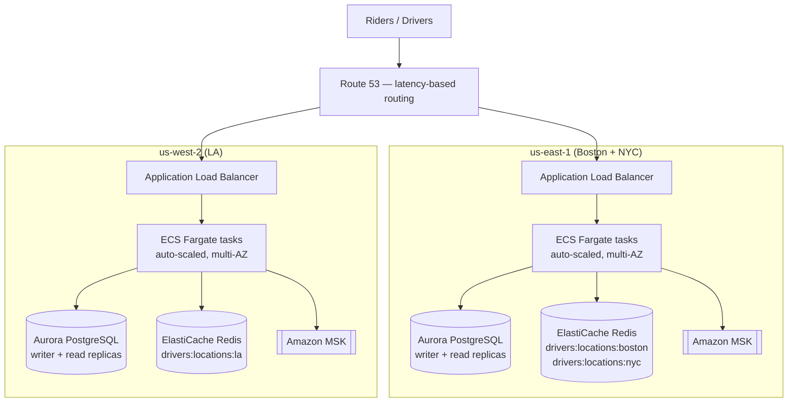

# System Design: Ride-Sharing Backend

**The question:**
> Design the backend system for a ride-sharing app (think Uber) that matches riders with nearby available drivers in real time, tracks driver location, calculates ETAs, and needs to scale to millions of concurrent users across many cities. Assume you have freedom to choose AWS services and your data stores.

This is the model answer built up from actually implementing this system (`uber_clone`, Kotlin/Spring) and stress-testing the design against a real interviewer's likely follow-ups.

---

## 1. Clarifying questions to ask first

Before designing anything, narrow scope — this is graded, not just throat-clearing:

- **Functional scope:** focus on ride request → match nearby driver → live location/ETA tracking. Exclude payments, ratings, and driver onboarding/KYC — call them out explicitly as out of scope.
- **Scale, concretely:** not just "millions of users" — get a number for peak concurrent active drivers/riders and peak requests/second, and whether load is spread evenly or concentrated in dense urban cores at rush hour.
- **Latency/consistency requirements:** how fast must a rider be matched (target: under ~5 seconds)? Is it acceptable for two drivers to briefly both think they got the same ride (eventual consistency), or must that be strictly prevented?
- **Platform constraints:** AWS (given).

---

## 2. Core request flow

1. Rider registers, driver registers (roles: `RIDER` default, upgradable to `DRIVER`).
2. Driver goes online → opens a long-lived **SSE connection** (`GET /driver/offers`) to receive ride offers, and their GPS location is written into a **Redis geo-index** (`GEOADD`), refreshed roughly every 5 seconds.
3. Rider requests a ride (`POST /rides`) → fare is calculated and locked in (see §5), the ride is saved as `REQUESTED`, a `ride-requested` event is published to **Kafka**, and the endpoint returns immediately — the rider isn't waiting on dispatch to complete.
4. A Kafka consumer (on any instance — partition assignment, not tied to whichever instance handled the original request) picks up the event, queries the Redis geo-index for nearby available drivers (5km radius, capped at ~20 candidates), and publishes an offer to each driver's Redis pub/sub channel (`ride_offers:{driverId}`).
5. Every backend instance subscribes to that same pub/sub pattern; only the instance actually holding that driver's SSE connection delivers the offer (see §4 — this is the answer to "how do you route to the right server").
6. First driver to `POST /rides/{id}/accept` wins the ride; concurrent accepts are resolved with optimistic locking (see §6), not blocking locks.
7. Rider gets a live SSE stream of driver location + ETA to pickup, then to destination, updated every ~5s as the driver's GPS reports in.
8. Ride completes; fare charged is the one locked in at request time, not recalculated.

---

## 3. Data stores, and why

| Store | Used for | Why |
|---|---|---|
| **PostgreSQL (Aurora)** | Users, rides, drivers — durable structured state | Relational fits naturally: rides have a clear state machine, foreign keys to riders/drivers, and need transactional consistency on state transitions. Low write volume relative to location pings. |
| **Redis** | Driver geo-index, availability set, pub/sub offer delivery, surge multiplier cache, rate-limit buckets | Everything here is high-frequency, latency-critical, and doesn't need Postgres's durability guarantees — a dropped location ping doesn't matter, it's superseded 5 seconds later. Keeping this out of Postgres is what makes the write volume (hundreds of thousands of location updates/sec at scale) tractable at all. |
| **Kafka (MSK)** | `ride-requested`/`accepted`/`completed`/`cancelled` events | Decouples the fast "ride saved" response from the slower dispatch work; durable, so a consumer crash or restart doesn't lose an in-flight ride request. |

---

## 4. Deep dive: routing a push notification to the right server at scale

**The problem:** a driver's SSE connection is pinned to whichever specific backend instance accepted it. The instance that decides "driver X should get this offer" (a Kafka consumer, which could be *any* instance) has no way of knowing which instance is holding driver X's live connection.

**The solution — broadcast-and-filter, not a connection-discovery service:** every instance subscribes to the same Redis pub/sub pattern (`ride_offers:*`) and keeps a **local, in-memory registry** (driver ID → SSE emitter) of only the connections *it* is currently holding. When a message is published to `ride_offers:driverX`, Redis delivers it to *every* subscribed instance — the one instance that actually has driver X's connection finds a match in its local registry and pushes the event; every other instance receives the same message and silently no-ops.

This avoids needing sticky sessions or a directory service mapping driver → instance, and avoids a whole class of bugs around stale routing state when instances restart or auto-scale. The trade-off: every instance receives every message, even irrelevant ones — wasted network chatter at very large fleet sizes. If that became measurable, the evolution path is a directory approach (consistent hashing driver ID → instance) so messages only go where needed.

**Supporting detail on why holding many connections per instance is even feasible:** Spring MVC's `SseEmitter` uses Servlet 3.0+ async support — the worker thread handling the initial request is released back to the pool immediately, not held for the connection's lifetime. The underlying Tomcat connector is NIO-based by default, so it can hold many thousands of *idle* connections per instance cheaply via a small number of poller threads (`epoll`/`kqueue` under the hood) — this is not the naive "one blocking thread per open connection" model. The real per-instance ceiling is JVM heap per connection object, not thread count.

---

## 5. Deep dive: fare, ETA, and surge

- **Fare** is calculated once at request time — `$2.00 base + $1.50/km × Haversine distance`, multiplied by a surge multiplier — and locked into `estimatedFare`. On completion, the charged fare is just that locked-in value, never recalculated. This matches real Uber behavior and protects rider trust (the price doesn't move mid-trip).
- **ETA** is Haversine (great-circle) distance divided by a fixed assumed average city speed. This is a known simplification worth naming proactively: straight-line distance ignores the actual road network and traffic, and a fixed speed constant doesn't vary by time of day. Production systems would integrate a real routing engine (Google Maps Directions API, OSRM) for both distance and live-traffic-aware ETA. Fine as an MVP-scope approximation, not something to present as production-accurate without caveating it.
- **Surge** is grid-cell based (lat/lng rounded to ~1km resolution), computed as `pending REQUESTED rides in that cell ÷ available nearby drivers`, capped 1.0-3.0x, cached in Redis for 30 seconds to avoid recomputing on every request in a busy cell.
- **A real scaling concern here:** the surge calculation's "pending nearby rides" count currently queries Postgres directly with a lat/lng bounding-box filter, synchronously inside the `POST /rides` request path. Without a composite index on `(status, pickup_lat, pickup_lng)`, this becomes a full scan as the rides table grows, and it directly adds latency to the ride-request response — slightly undercutting the "response is fast, dispatch is async" principle elsewhere in the design. Since `REQUESTED` rides are already tracked in Redis for dispatch purposes, a better approach at scale is a live per-grid-cell pending-count maintained in Redis instead of querying Postgres on this hot path at all.

---

## 6. Deep dive: resolving the ride-acceptance race

Multiple drivers can receive the same ride offer and tap "accept" within moments of each other. Two options, and why one is clearly better here:

- **Pessimistic locking** (`SELECT ... FOR UPDATE`): locks the row at read time; every other driver's accept attempt queues up waiting for the lock to release. Right tool when contention is *high and sustained* (e.g., a counter incremented continuously by many workers) — not the case here.
- **Optimistic locking** (`@Version` column): no lock held. The `UPDATE` includes `WHERE version = ?`; if the row changed since it was read, the update affects zero rows and the loser gets a `409` immediately — no blocking, no queueing. Right tool when contention is *rare and short-lived*, which describes this exact scenario: a handful of drivers racing over a couple of seconds, and a loser just needs to be told "someone else got it," not retried or queued.

This is implemented and working in the actual codebase — `acceptRide` catches `ObjectOptimisticLockingFailureException` and returns `409`, with the driver app expected to treat that as "offer no longer available" rather than an error.

**A related gap worth naming:** the re-dispatch retry (below) currently doesn't exclude drivers who already saw and ignored an offer, or expand the search radius — it just re-runs the identical dispatch. A stronger version would use the existing `dispatched:{rideId}` Redis set (already tracking who was offered a given ride) to exclude repeat offers and/or widen the radius on retry.

---

## 7. Deep dive: handling rides nobody accepts

A scheduled job (`StaleRideRetryJob`, `@Scheduled(fixedDelay = 60_000)`) finds rides still `REQUESTED` after 2 minutes and republishes the same `ride-requested` Kafka event — reusing the exact same dispatch path a fresh request uses, rather than a separate code path.

**Real numbers, not hand-waved ones:** with a 60-second poll interval and a 2-minute staleness threshold, worst-case detection latency is up to ~3 minutes before a stuck ride gets re-dispatched — worth being precise about this if asked, since a rider waiting 3 minutes with no feedback is a genuine UX problem, not just a technical footnote.

**A correctness bug this surfaces once you horizontally scale:** `@Scheduled` jobs run independently **on every instance** by default. With N instances, this job runs N times a minute, each independently finding and republishing the same stale rides — duplicate dispatch, wasted Kafka messages, potentially duplicate offers to the same drivers. This needs a distributed coordination mechanism to run exactly once across the fleet: a distributed lock (e.g., ShedLock, backed by a Postgres row or Redis key), or moving the trigger outside the app entirely (an AWS EventBridge scheduled rule hitting one endpoint). This is exactly the kind of gap that separates "I can build a feature" from "I can build a *distributed* system."

There's also no terminal give-up state currently — a ride with genuinely no drivers available would retry indefinitely. A max-retry count with a "no drivers found" message back to the rider is a needed addition.

---

## 8. AWS deployment

**Regional topology:** ride matching is inherently local — a driver in LA never matches a rider in Boston — so the deployment is split by region rather than run as one global stack: **`us-east-1`** serves Boston + NYC, **`us-west-2`** serves LA (LA is ~2,500 miles / 60-80ms round-trip from the East Coast; no cross-region data dependency exists to justify eating that latency). Each region is fully self-contained — its own compute, Postgres, Redis, Kafka — which gives fault isolation as a side effect: an outage in one region doesn't touch the other. **Route 53** with latency-based routing sends each user to whichever region is actually closest.

**Capacity assumptions** (anchored to a real reference point, not a raw guess): NYC's Taxi & Limousine Commission capped for-hire vehicle licenses at ~100,000 (2018, across all platforms combined). Applying a rough utilization rate (~35% actively on shift at peak) and single-platform market-share discount (~60%) gives `100,000 × 35% × 60% ≈` **~20,000 concurrent drivers for one app in NYC at peak**. LA (~10-12k) and Boston (~3-5k) are lower-confidence relative scaling — no equivalent regulatory anchor. Total: **~35-40k concurrent driver SSE connections** across all three cities, not the much larger number a naive city-size guess would produce.

**Component choices, and — importantly — what was deliberately left out:**
- **Compute:** ECS on Fargate (not EKS — this is one Spring Boot service, not a fleet of microservices), auto-scaled on connection count/CPU rather than statically provisioned, since driver SSE volume swings heavily between rush hour and overnight. At ~10-15k idle connections per task, `us-east-1`'s ~25k connections needs only ~2-3 tasks for connection-holding alone — realistic total per region including multi-AZ redundancy lands around 3-4 tasks, not the dozens a naive city-population guess would suggest.
- **ALB idle timeout** must be raised above its 60-second default (or offset with server-side heartbeats), or it will silently drop the long-lived SSE connections the whole design depends on.
- **Aurora over vanilla RDS** for read-replica scaling (up to 15) and lower replication lag.
- **No RDS Proxy** — and this is a deliberate omission, not an oversight. At ~3-4 ECS tasks per region and Spring Boot's default HikariCP pool size (10), worst case is ~30-40 real connections — nowhere near enough to threaten Aurora's connection limit. Adding a proxy here would be paying for a problem this deployment doesn't have; the right trigger to revisit this is task count growing substantially or connection metrics actually showing pressure, not adding it pre-emptively.
- **Redis is logically sharded per city** (`drivers:locations:{city}`) rather than physically split per city up front — Redis Geo commands operate per key, so this already isolates each city's data on a shared cluster. Worth knowing the limitation: Redis Cluster mode shards *by key*, so it doesn't parallelize a single city's geo lookups across nodes — all of one city's data lives on whichever shard owns that key. A city only gets split onto its own cluster if its load actually demands it.
- **Kafka via Amazon MSK**, one cluster per region, alongside the rest of that region's stack.
- **Postgres itself isn't pre-emptively sharded by city either** — start with one cluster per region and a `city_id` column; split further only if a specific city's write volume actually demands isolation. Building for hypothetical future scale before metrics justify it is the same mistake as the RDS Proxy call above.

---

## 9. What I'd improve with more time

- Max-retry / terminal failure state for undispatched rides, with a clear message back to the rider.
- Distributed locking (ShedLock or an external scheduler) for the stale-ride retry job before running more than one instance.
- Replace the Postgres-backed surge "pending nearby rides" count with a live Redis counter, and add the composite index either way.
- Real routing-engine integration for ETA/distance instead of straight-line Haversine, if road-network accuracy becomes a priority over simplicity.
- Excluding already-offered drivers and expanding search radius on stale-ride retry, rather than repeating an identical dispatch.
